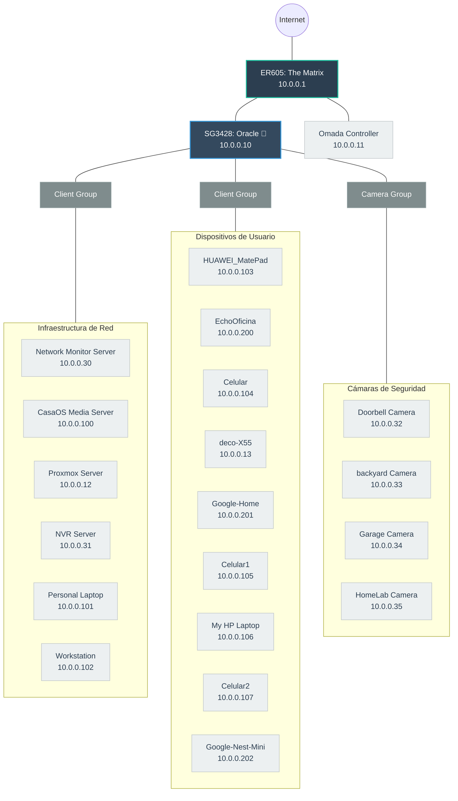
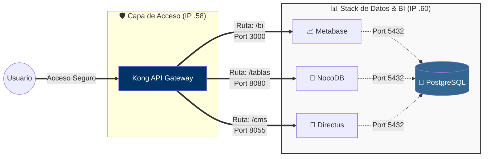

<div align="center">

# 🏠 Homelab Architecture


**Documentación de mi homelab con diagramas de red y arquitectura de servicios**

[📊 Topología](#️-topología-de-red) • [🏗️ Arquitectura](#️-arquitectura-de-servicios) • [📖 Segmentación](#-segmentación-de-red)

</div>

---

## 📋 Contenido

- [🗺️ Topología de Red](#️-topología-de-red)
- [🏗️ Arquitectura de Servicios](#️-arquitectura-de-servicios)
- [📊 Segmentación de Red](#-segmentación-de-red)
- [📖 Documentación](#-documentación)

---

## 🗺️ Topología de Red

Infraestructura de red física del homelab con **The Matrix** como router principal y **Oracle** como switch core.



---

## 🏗️ Arquitectura de Servicios

### Stack de Datos (10.0.0.60)

Servicios de BI y gestión de datos corriendo en contenedores Docker.



---

## 📊 Segmentación de Red

Plan de direccionamiento IP por función y propósito.

| Rango | Propósito |
|:------|:----------|
| **10.0.0.1 – 9** | Gateway / Firewall |
| **10.0.0.10 – 19** | Core / Infra |
| **10.0.0.20 – 29** | Dev / Staging interno |
| **10.0.0.30 – 39** | Observabilidad / Seguridad |
| **10.0.0.50 – 69** | Servicios base (DevOps / acceso) |
| **10.0.0.70 – 99** | Apps públicas |
| **10.0.0.100 – 199** | Media / Usuario |
| **10.0.0.200 – 229** | Automatización / IoT |
| **10.0.0.230 – 254** | IA / Labs / Experimentos |

---

## 📖 Documentación

### Estructura del Repositorio

```
homelab-architecture/
│
├── README.md                    # Este archivo
├── diagrams/                    # Diagramas fuente Mermaid
├── docs/                        # Documentación adicional
├── screenshots/                 # Capturas de pantalla
└── configs/                     # Configuraciones de ejemplo
```

---

## 👨‍💻 Autor

**DevLewiso**

- GitHub: [@devlewiso](https://github.com/devlewiso)

---

<div align="center">

Hecho con ❤️ para documentar mi homelab

</div>
